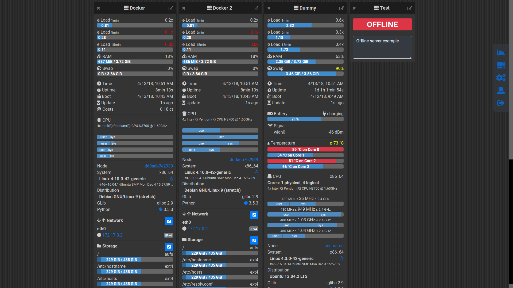

# yamot - Yet Another MOnitoring Tool

**yamot** is a web-based server-monitoring tool built for small environments with just a handful  servers.
It takes a minimum of resources which allows the execution on almost every machine, also very old ones.
It works best with Linux or BSD. Windows is not part of the server scope.

You could use it for example to monitor your Raspberry Pi Servers running at home.
It takes only a few steps of configuration and after that it displays much relevant server measurement data in your browser:

- System Load
- Memory Usage
- Uptime / Boot Time
- Costs (calculated)
- Battery (e.g. for monitoring a mobile device)
- WiFi Signal Strength
- Temperatures
- Processor (Cores, Speed, Usages, ...)
- System (Distro, Version, Architecture, …)
- Network Services (Open Listening Ports)
- Network Devices & Addresses
- Network Interfaces IO (bytes sent/received)
- Disk Storage Usage (used & total space)
- Disk Device IO (bytes read/written)
- Users logged in (name, login date, …)

All this information is displayed in real-time on one page to give an uncomplicated overview.
If you are looking for something big, feature-rich and scalable you are definitely wrong here. For a business solution have a look at [Nagios](https://www.nagios.org/) instead.

## Architecture
The architecture is divided up into three parts (original MVC)

### Server Component
This component needs to be executed on the server-system which you want to monitor. It’s basically a simple webserver. For security reasons it just has readonly access to the system. **The Auth is done via HTTP Basic Auth, so don’t use it in untrusted networks!**

The Server component provides realtime data only. There are no cyclical background tasks or other stuff running which occupy the processor/memory/disk. If you don’t access the server it will take up almost no resources.
The server is built with Python3, which of course needs to be installed. Default server port is 9393.

### Controller Component
One server needs to have the additional role of the controller. The controller is also just a webserver which provides a REST-API to manage the application.

**The Auth is also done via HTTP Basic Auth, so also don’t use it in untrusted networks!**
The controller is built with node.js and express.js. If you don’t have those installed, you could also use the Docker-Image called **prod**. Default controller port is 8080.

### Client Component
Finally the client represents the web-page and gets served by the Controller (on port 8080).
The client is built with Angular, some Bootstrap CSS and a subset of FontAwesome Icons.
A refresh-cycle to display new data (every 3sec per default) incurs requesting all your servers to get updates of the measured data.

                        WebFiles          .--------.
     .--------.-----------REQ------------>|  ____  |
     |  ____  |<----------RES-------------| |====| |
     | |    | |                           | |    | |
     | |____| |        ServerList         | |    | |
     | /::::/ |-----------REQ------------>| |____| |
     '--------'<----------RES-------------'--------'
       Client                             Controller

     .--------.        ServerData       .--------------.
     |  ____  |-----------REQ---------->|  __________  |
     | |    | |<----------RES-----------| |____oooo_°| |        -------.
     | |____| |                         '--------------'               |
     | /::::/ |                              Server 1           ^      |
     |        |                                                 |      |
     |        |        ServerData       .--------------.        |      |
     |        |-----------REQ---------->|  __________  |        '-------
     |        |<----------RES-----------| |____oooo_°| |
     '--------'                         '--------------'
       Client                                Server 2

## Getting started

Before installing: Try it via docker, there are multiple docker images available. Just try the **demo** image to get a first impression.

### Installation

#### Server
1. Install python3 and psutil and ujson on every server with `sudo apt-get install python3-psutil python3-ujson`.
If you are not running an apt-based system (Debian or Ubuntu) use `sudo pip3 install psutil` instead.
2. Copy the file yamot_server.py to your server (e.g. under /opt/yamot) and add it to /etc/rc.local as `sudo -u ` **username** ` dash -c 'cd /opt/yamot && python3 /opt/yamot/yamot_server.py' &` in front of the “exit 0”-line (enable autostart)
3. Run the server once interactively via `python3 yamot_server.py` to generate a config file (needs one-time write permission in the same folder).
4. If you are running a firewall on your server (like ufw) open the specified port `sudo ufw allow 9393` (default port is 9393)

#### Client & Controller
5. The controller-component needs to be running on a server in your network (the same network where also the servers are running). The server which runs the controller can also run the server component at the same time. Use the content of the folder `controller/dist`.
6. You will need a node.js installation with express.js (or docker, if you use the prod image)
7. Use `node controller.js` to start the controller and check if it is working
8. The login credentials will be provided by the controller on startup in the shell.
9. Now you could also add it to the autostart of the system. Don’t forget to open the port if you are using a firewall.
10. If you are done, open browser and navigate to [http://*ip-of-the-controller-device*:8080](http://ip-of-the-controller-device:8080)
(8080 is the default controller port)

### Docker

There are three docker images available which follow various purposes.

All images needs to be built from the corresponding dockerfile. Just use the additional shell scripts.

#### build
- transpiles the client and controller code into the dist-folder in a consistent environment, there is no need to build the server
#### prod
- contains the controller & client for productive usage, just add the container to your docker infrastructure
#### demo
- contains all components to show how the application is supposed to work

- URL: [http://localhost:8080/](http://localhost:8080/)

- login credentials: 
    - Username: yamot
    - Password: test123

- The docker container gets measured and also a dummy server produces random data.
- All changes will be reverted on next container startup, so you can easily try it out.

## Contributing

Bug Reports & Pull Requests are welcome!
